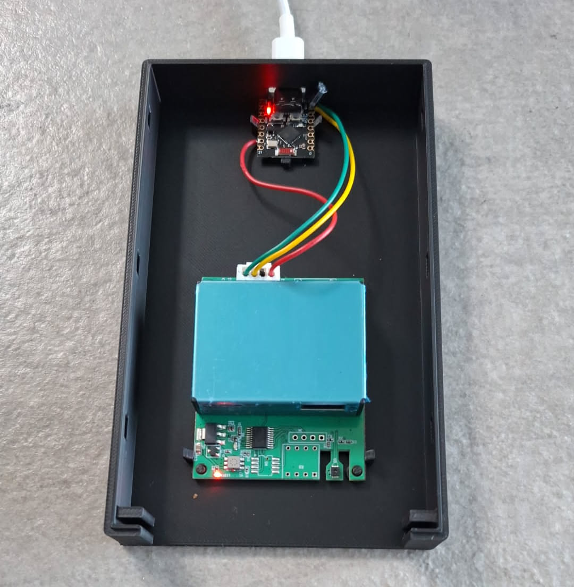

# Esphome Library for the M702B Air Quality Sensor
Esphome library for reading out the M702B air quality sensor
Includes STL files for 3D printing a case.



# Hardware:

M702B Air quality sensor.
https://amzn.to/4eAWg3c

esp32-c3 Super Mini works great, the 5V DC output and UART connection can be connected directly to the M702B sensor mainboard. Add a 10 µF capacitor on the 5V DC power line to stabilize.
https://amzn.to/4awBYXJ

# YAML
```
sensor:
  - platform: air_quality_sensor
    average: 10
    CO2:
      name: CO2
    CH2O:
      name: CH2O
    TVOC:
      name: TVOC
    PM25:
      name: PM25
    PM10:
      name: PM10
    temperature:
      name: temperature
    humidity:
      name: humidity
```
